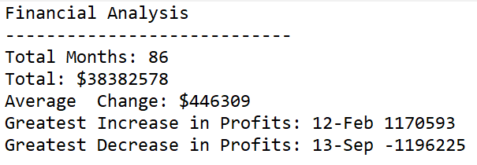

# Automate Your Day Job with Python.

### PyBank - Background
You've made it! It's time to put away the Excel sheet and join the big leagues. Welcome to the world of programming with Python. 

In this homework assignment, you'll be using the concepts you've learned to complete Python activity, PyBank. Both activities present a real-world situation in which your newfound Python skills will come in handy. These activities are far from easy, though, so expect some hard work ahead!

In this activity, you are tasked with creating a Python script for analyzing the financial records of your company. You will be provided with a financial dataset in this file: budget_data.csv. This dataset is composed of two columns: Date and Profit/Losses. (Thankfully, your company has rather lax standards for accounting, so the records are simple.)
Your task is to create a Python script that analyzes the records to calculate each of the following:

* The total number of months included in the dataset.

* The net total amount of Profit/Losses over the entire period.

* The average of the changes in Profit/Losses over the entire period.

* The greatest increase in profits (date and amount) over the entire period.

* The greatest decrease in profits (date and amount) over the entire period.

